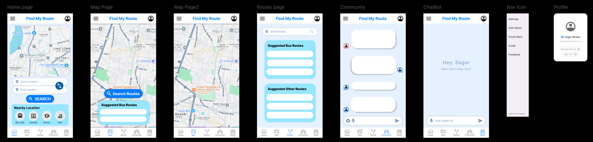
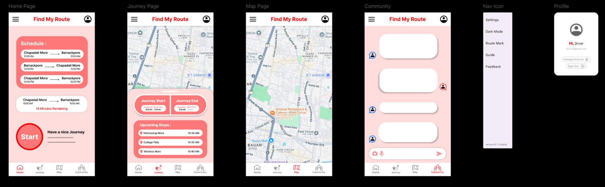

# 🚌 Find My Route - Smart Transit Navigation App
## Current Stack
[](https://flutter.dev)
[](https://firebase.google.com)
[](https://www.openstreetmap.org)

> **Your ultimate companion for navigating India's transport network with 105+ real bus routes, live maps, and community-driven features.**
>
## Current Design Goal
 ### User page


<h3>Driver Page</h3>


## ✨ Key Features

### 🗺️ **Interactive Maps**
- **Live Location Tracking** with GPS integration
- **Real-time Map Visualization** using OpenStreetMap
- **Route Markers** and navigation points
- **Current Location Button** for instant positioning

### 🚌 **Comprehensive Route Database**
- **105+ Bus Routes** covering Kolkata, Barasat, and North 24 Parganas
- **Real Route Data** sourced from WBTC, CTC, and SBSTC
- **Accurate Travel Times** based on traffic and distance
- **Multiple Route Categories**:
  - Barasat originating routes (BA series)
  - Kolkata city routes (K series)  
  - North 24 Parganas district routes (DN series)
  - Howrah division routes (H series)
  - South Kolkata routes (S series)
  - AC/Volvo long-distance routes (AC series)
  - Minibus routes (M series)

### 🔍 **Smart Search System**
- **Origin-Destination Search** with route swapping
- **Intelligent Route Suggestions** 
- **Multi-modal Transport Options** (Bus, Metro, Taxi, Auto)
- **Real-time Route Planning**

### 👥 **Community Features**
- **User Authentication** with Firebase
- **Community Discussion** platform
- **Route Sharing** and recommendations
- **Saathi (Companion)** feature for travel buddies

### 📱 **Modern UI/UX**
- **Clean Material Design** interface
- **Intuitive Navigation** with bottom navigation bar
- **Responsive Layout** for all screen sizes
- **Professional Color Scheme** with blue accents

## 🚀 Getting Started

### Prerequisites
- Flutter SDK (3.9.0+)
- Firebase account and project setup
- Android Studio or VS Code
- Physical device or emulator

### Installation

1. **Clone the repository**
   ```bash
   git clone https://github.com/arpan7sarkar/find-my-route.git
   cd find-my-route
   ```

2. **Install dependencies**
   ```bash
   flutter pub get
   ```

3. **Configure Firebase**
   - Create a new Firebase project
   - Add your `google-services.json` (Android) and `GoogleService-Info.plist` (iOS)
   - Update `firebase_options.dart` with your configuration

4. **Run the app**
   ```bash
   flutter run
   ```

## 🛠️ Tech Stack

| Technology | Purpose |
|------------|---------|
| **Flutter** | Cross-platform mobile development |
| **Firebase Core** | Backend infrastructure |
| **Firebase Auth** | User authentication |
| **Firestore** | Real-time database |
| **Flutter Map** | Interactive map display |
| **Geolocator** | GPS and location services |
| **OpenStreetMap** | Map tiles and data |

## 📱 App Structure

```
lib/
├── main.dart                 # App entry point
├── firebase_options.dart     # Firebase configuration
├── pages/                    # Screen components
│   ├── home_page.dart       # Main dashboard
│   ├── routes_page.dart     # Route search & results
│   ├── community_page.dart  # Community features
│   ├── saathi_page.dart     # Travel companion
│   ├── map_page_two.dart    # Enhanced map view
│   └── auth_wrapper.dart    # Authentication handler
├── widgets/                  # Reusable UI components
│   ├── custom_app_bar.dart  # Branded app bar
│   ├── nearby_locations.dart # Location suggestions
│   └── bottom_navigation.dart # Navigation bar
├── models/                   # Data structures
├── services/                 # Business logic
└── utils/                    # Helper functions
```

## 🎯 Core Features Breakdown

### 🏠 Home Screen
- **Interactive Map Preview** with current location
- **Smart Location Input** with start/end swapping
- **Nearby Suggestions** for popular destinations
- **One-tap Location Access** via GPS

### 🗺️ Map View  
- **Full-screen Interactive Map** with zoom controls
- **Real-time Location Tracking**
- **Route Visualization** and markers
- **Multi-layer Map Support**

### 🚌 Routes Page
- **105+ Pre-loaded Routes** with real data
- **Smart Route Filtering** and search
- **Multi-modal Suggestions** (Bus/Metro/Taxi/Auto)
- **Estimated Travel Times**

### 👥 Community Hub
- **User Discussion Forums**
- **Route Reviews and Ratings**
- **Real-time Updates** from fellow travelers
- **Travel Tips Sharing**

## 📊 For Now Route Categories

| Category | Routes | Coverage Area |
|----------|---------|---------------|
| **Barasat Routes (BA)** | 20 | Barasat to major destinations |
| **Kolkata City (K)** | 20 | Intra-city connections |
| **North 24 Parganas (DN)** | 15 | District-wide coverage |
| **Howrah Division (H)** | 10 | Howrah and surroundings |
| **South Kolkata (S)** | 15 | Southern neighborhoods |
| **AC/Volvo (AC)** | 10 | Long-distance premium |
| **Minibus (M)** | 15 | Local area connectivity |

## 🎨 Design Philosophy

The app follows **Material Design 3** principles with:
- **Primary Blue Theme** (#2196F3) for trust and reliability
- **Clean White Backgrounds** for readability
- **Subtle Shadows** for depth and hierarchy
- **Rounded Corners** for modern aesthetics
- **Intuitive Icons** for universal understanding

## 🚦 Future Roadmap

### Phase 2 Features
- [ ] **Real-time Bus Tracking** with live locations
- [ ] **Offline Map Support** for low connectivity areas
- [ ] **Voice Navigation** assistance
- [ ] **Fare Calculator** for different transport modes
- [ ] **Multi-language Support** (Bengali, Hindi, English)

### Phase 3 Enhancements
- [ ] **AR Navigation** for complex intersections
- [ ] **Carbon Footprint Tracker** for eco-friendly travel
- [ ] **Integration with Payment Gateways** for digital tickets
- [ ] **AI-powered Route Optimization**

## 🤝 Contributing

We welcome contributions from the developer community! Here's how you can help:

1. **Fork the repository**
2. **Create a feature branch** (`git checkout -b feature/AmazingFeature`)
3. **Commit your changes** (`git commit -m 'Add some AmazingFeature'`)
4. **Push to the branch** (`git push origin feature/AmazingFeature`)
5. **Open a Pull Request**

### Contributing Guidelines
- Follow Flutter/Dart best practices
- Add comments for complex logic
- Update documentation for new features
- Test on both Android and iOS platforms
- Maintain consistent coding style

## 📄 License

This project is licensed under the MIT License - see the [LICENSE](LICENSE) file for details.

## 👨‍💻 Developer

**Arpan Sarkar**
- 🌐 [GitHub](https://github.com/arpan7sarkar)
- 📧 [Email](contact.arpan.sarkar@gmail.com)
- 💼 [LinkedIn](https://linkedin.com/in/arpan7sarkar)

**Sagar Bhadra**
- 🌐 [GitHub](https://github.com/SagarBhadra01)

**Barshan Majumdar**
- 🌐 [GitHub](https://github.com/Barshan-Majumdar)

**Subhamoy Datta**
- 🌐 [GitHub](https://github.com/subhamoydatta703)

**Soumyadip Khan Sarkar**
- 🌐 [GitHub](https://github.com/Soumyadip-03)

**Shreya Gupta**


## 🙏 Acknowledgments

- **India Transport Corporation** for route data
- **Calcutta Tramways Company (CTC)** for operational insights  
- **South Bengal State Transport Corporation (SBSTC)** for regional routes
- **OpenStreetMap Contributors** for map data
- **Flutter Community** for amazing packages and support

## 📱 Download & Support

[](https://github.com/arpan7sarkar/find-my-route)

**Found this helpful?** ⭐ Star the repository to show your support!

---

<div align="center">

**Made with ❤️ for Indian Commuters**

*Helping thousands navigate their daily journeys with confidence*

</div>
